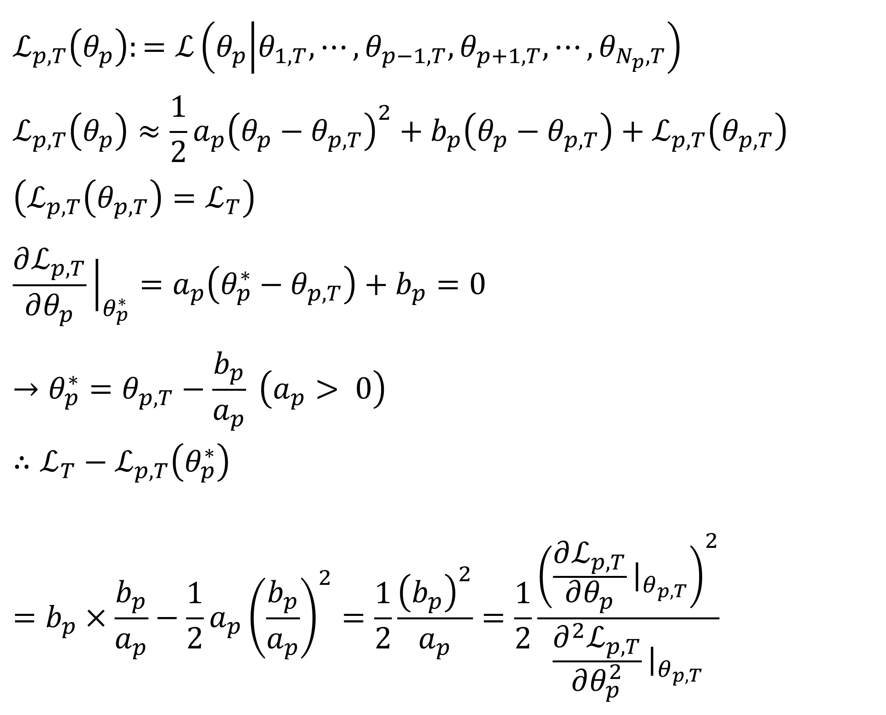

# Learning rate Scheduling based on Parameter Sensitivity
## 1. Introduction
There is no clear standard for which parameters should be fine-tuned or how to fine-tune them during post-training. In this repository, I aim to explore post-training by adjusting the learning rate based on parameter sensitivity, grounded in the research I conducted during my master's program.

## 2. Origin

During my masters' degree, I defined a sensitivity measure function called the 'Level of Convergence (LC)'. It is based on the idealized changes in the loss function value throughout the training.

The Level of Convergence (LC) is defined as the difference between the current loss value and the loss value when the parameter p reaches its optimal (ideal) state.

Through this, we can assess the sensitivity of each individual parameter. However, most parameter fine-tuning today is performed at the matrix or tensor level. Therefore, during my master’s program, I recognized the necessity of extending this approach to the matrix or tensor level.

Given that most modern models involve billions of parameters and are trained on enormous datasets, computing second-order derivatives becomes prohibitively time-consuming and computationally inefficient. Accordingly, this repository introduces a more practical and scalable version of my research.

## 3. Methods
Approximate LC efficiently by this procedure
