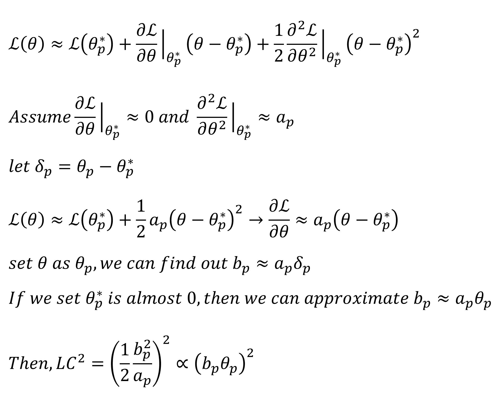

# Learning rate Scheduling based on Parameter Sensitivity
## 1. Introduction
There is no clear standard for which parameters should be fine-tuned or how to fine-tune them during post-training. In this repository, I aim to explore post-training by adjusting the learning rate based on parameter sensitivity, grounded in the research I conducted during my master's program.

## 2. Origin

During my masters' degree, I defined a sensitivity measure function called the 'Level of Convergence (LC)'. It is based on the idealized changes in the loss function value throughout the training.

The Level of Convergence (LC) is defined as the difference between the current loss value and the loss value when the parameter p reaches its optimal (ideal) state.

Through this, we can assess the sensitivity of each individual parameter. However, most parameter fine-tuning today is performed at the matrix or tensor level. Therefore, during my master’s program, I recognized the necessity of extending this approach to the matrix or tensor level.

Given that most modern models involve billions of parameters and are trained on enormous datasets, computing second-order derivatives becomes prohibitively time-consuming and computationally inefficient. Accordingly, this repository introduces a more practical and scalable version of my research.

## 3. Methods
Approximate LC efficiently by this procedure

Through this, I was able to identify equations that serve a similar role to the one I proposed. However, while my proposed formulation is based on scalar-level parameters, most learning rate adjustments are performed at the matrix or tensor level. Therefore, to obtain a representative value at the matrix or tensor level, I utilized Singular Value Decomposition (SVD). After computing the SVD, I summed all the singular values to quantify the sensitivity at the matrix or tensor level. Based on the computed sensitivity, I then adjusted the learning rate accordingly.

## 4. Experiment
To evaluate the effectiveness of the proposed method, I conducted a simple experiment. I tested whether the model could effectively learn to map human instructions to robot planning using a dedicated dataset. For this purpose, I used the robot task planning dataset from Hugging Face (https://huggingface.co/datasets/detek/robot-task-planning), and the base model was Qwen2.5-Coder-1.5B-Instruct (https://huggingface.co/Qwen/Qwen2.5-Coder-1.5B-Instruct). I compared the proposed learning rate scheduler with a fixed learning rate and the cosine annealing scheduler.

The dataset was split into training and validation sets at an 8:2 ratio, resulting in 788 training samples and 197 validation samples. I compared the training loss, validation loss during training, and the ROUGE score after training. For training, I used the LoRA (Low-Rank Adaptation) method and implemented code to dynamically adjust the learning rate specifically for the LoRA parameters.

|   Metric   |  My Method  |  Constant LR  |  Cosine Annealing LR  |
|:----------:|:-----------:|:-------------:|:----------------------:|
|  Rouge-1   |   0.6813    |    0.6404     |        0.2095          |
|  Rouge-2   |   0.5414    |    0.4747     |        0.0997          |
|  Rouge-L   |   0.6593    |    0.6092     |        0.1885          |
| Rouge-Sum  |   0.6760    |    0.6307     |        0.2032          |

In this table, ‘My Method’ refers to the learning rate scheduling strategy I proposed. ‘Constant LR’ represents training with a fixed learning rate, while ‘Cosine Annealing LR’ uses the cosine annealing scheduling technique. As shown in the results, my method achieves lower train and validation loss, as well as higher ROUGE scores across all metrics compared to the other approaches.

## 5. Conclusion
For each batch, I approximated the Level of Convergence function proposed in my master’s research in a simplified manner. The results showed that this approach led to faster training compared to commonly used methods. This suggests the potential of dynamically adjusting the learning rate based on the characteristics of each dataset to accelerate the training process.